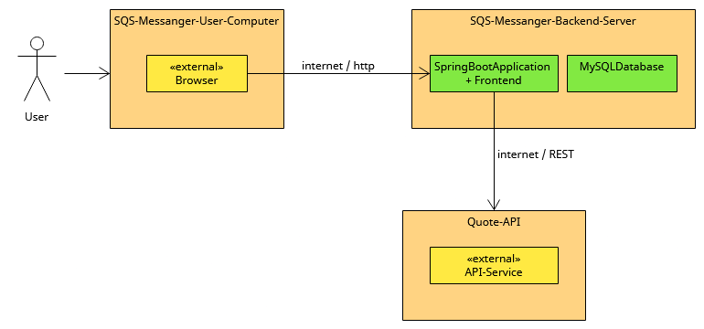

# 3. Technical Context View

The following diagram shows the participating computers (nodes) with their technical connections plus the major artifacts of SQS-Messanger.

[Technical_Context_View](Files/3/Technical_Context_View.uxf)

| Node / Artifact                  | Description                                      |
|----------------------------------|--------------------------------------------------|
| SQS-Messanger-Backend-Server     | where  takes place                               |
| SQS-Messanger-User-Computer      | where user physically interacts with Messenger   |
| Quote-API                        | where Quotes are taken from                      |
| SpringBootApplication + Frontend | Backend (Java) and Frontend (Typescript) (owned) |
| MySQLDatabase                    | Database (MySQL) (owned)                         |