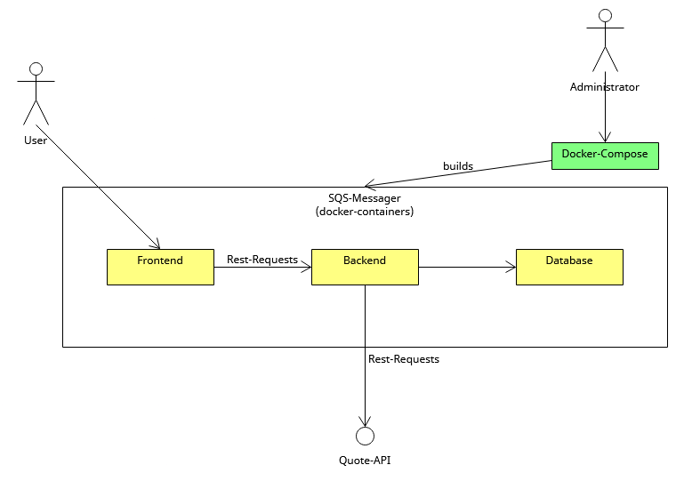

# 5. Solution Strategy

[Building Blocks - Level 1](Files/5/Level1.uxf)

| Building block | Description                                                                                          |
|----------------|------------------------------------------------------------------------------------------------------|
| Frontend       | React-typescript frontend for the user                                                               |
| Backend        | Backend that implements the logic and servers as connection between Frontend, Database and Quote-API |
| Database       | MSQL-Database that saves data (Messages, Comments, ...)                                              |
| Quote-API      | External-API that is used to get Quotes for Messages                                                 |
| Docker-Compose | Used to create Docker-Containers for Frontend, Backend and Database via yaml-File                    |