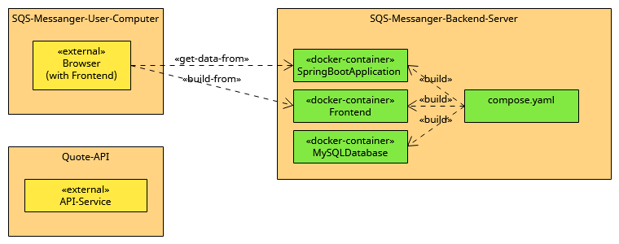

# 7. Deployment View

The following diagram shows the participating computers (nodes) with their technical connections plus the major artifacts of SQS-Messanger.

[Deployment View](Files/7/Deployment_View.uxf)

| Node / Artifact              | Description                  |
|------------------------------|------------------------------|
| SQS-Messanger-Backend-Server | Service environment          |
| SQS-Messanger-User-Computer  | User environment             |
| Quote-API                    | 3rd-Party environment        |
| SpringBootApplication        | Backend (Java)(owned)        |
| Frontend                     | Frontend (Typescript)(owned) |
| MySQLDatabase                | Database (MySQL)(owned)      |
| compose.yaml                 | Describes and builds Service |