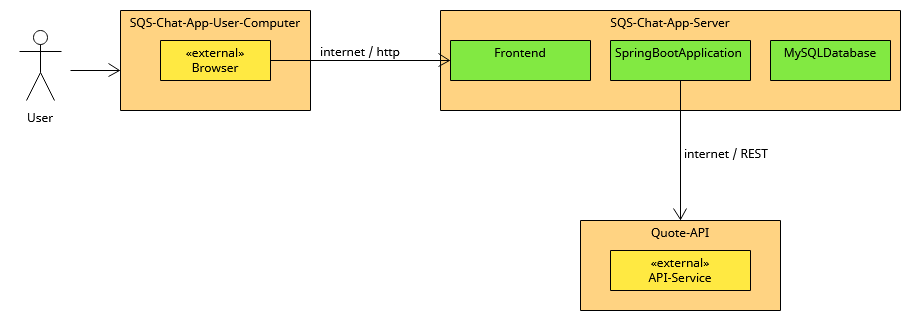

# 3. Technical Context View

The following diagram shows the participating computers (nodes) with their technical connections plus the major artifacts of the SQS-Chat-App.

[Technical_Context_View](Files/3/Technical_Context_View.uxf)

| Node / Artifact                  | Description                                              |
|----------------------------------|----------------------------------------------------------|
| SQS-Chat-App-Server              | where application-logic and data-persistence takes place |
| SQS-Chat-App-User-Computer       | where user physically interacts with Chat-App            |
| Quote-API                        | where Quotes are taken from                              |
| SpringBootApplication + Frontend | Backend (Java) and Frontend (Typescript) (owned)         |
| MySQLDatabase                    | Database (MySQL) (owned)                                 |