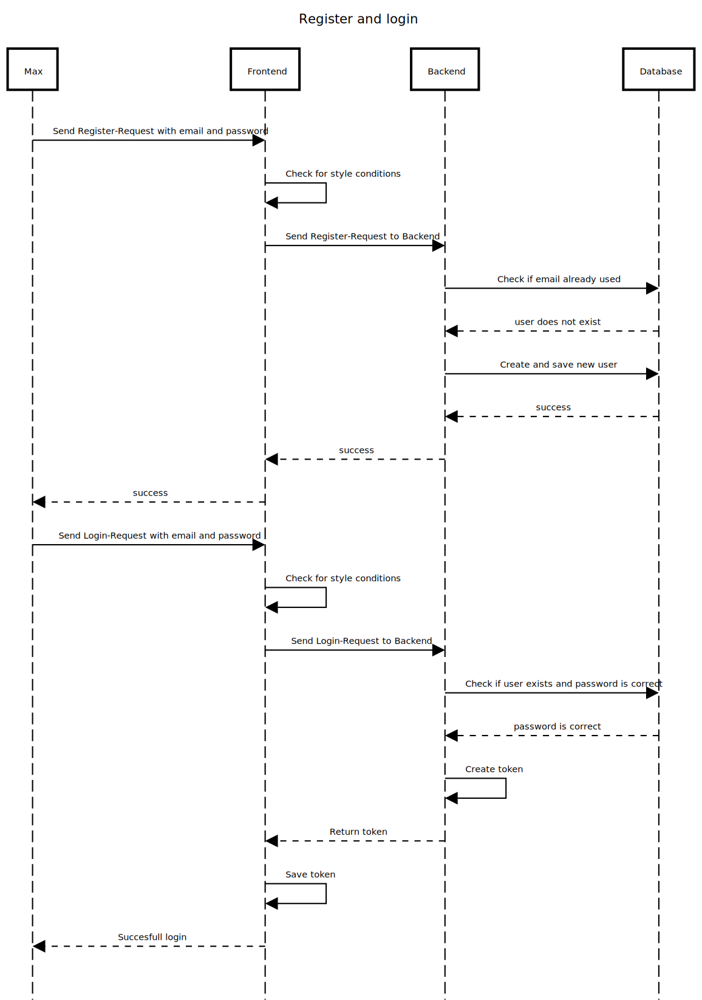
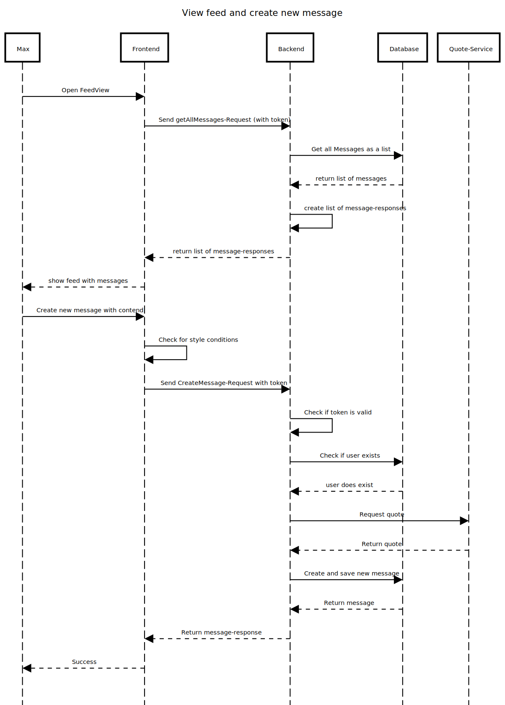
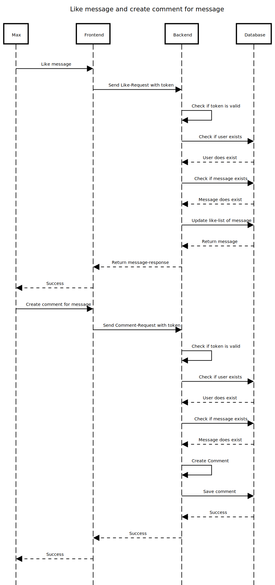

# 6. Runtime View

## 6.1 Registration and Login

[RegisterAndLogin](Files/6/RegisterAndLogin.txt)

### Registration:
1. User wants to create new account
2. Frontend checks for style conditions
3. Frontend sends register-request to backend
4. Backend checks if the email is already used
5. Backend creates new user and saves it in the database
6. Backend returns success-message
7. Frontend returns success-response

### Login:
1. User wants to log in
2. Frontend checks for style conditions
3. Frontend sends login-request to backend
4. Backend checks if user exists and password is correct
5. Backend creates jwt-token
6. Backend returns jwt-token
7. Frontend saves token

## 6.2 Viewing the Feed and Creating a new message

[ViewFeedAndCreateNewMessage](Files/6/ViewFeedAndCreateNewMessage.txt)

### Viewing the Feed:
1. User opens FeedView
2. Frontend sends getAllMessages-request to backend (with the jwt-Token)
3. Backend sends getAllMessages-query to database
4. Database returns list of messages
5. Backend creates list of message-responses
6. Backend returns list of message-responses
7. Frontend shows feed with messages

### Creating a new message:
1. User wants to create new message
2. Frontend checks for style conditions
3. Frontend sends CreateMessage-Request to Backend with the jwt-Token
4. Backend checks if the token is valid and if the user exist in the database
5. Backend requests Quotes form Quote-Service
6. Backend creates new message and saves it in the database
7. Database returns the new message
8. Creates message-response
9. Backend returns message-response

## 6.2 Liking a Message and creating comment for Message

[LikeMessageAndCreateCommentForMessage](Files/6/LikeMessageAndCreateCommentForMessage.txt)

### Liking a Message:
1. User presses the like button of a message
2. Frontend sends like-request to backend with the jwt-Token
3. Backend checks if the token is valid and if the user and the message exist in the database
4. Backend updates the likes of the message and updated the database
5. Backend returns a message-response of the updated message
6. Frontend tells the user that the like was successful

### Creating new Comment:
1. User wants to create comment
2. Frontend sends comment-request with toke to backend with the jwt-Token
3. Backend checks if the token is valid and if the user and the message exist in the database
4. Backend creates comment, connects it to message and saves it to / updates the database
5. Database returns success-message
6. Backend returns success-message
7. Frontend returns success-message